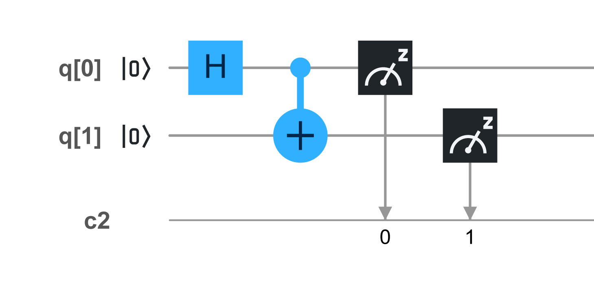
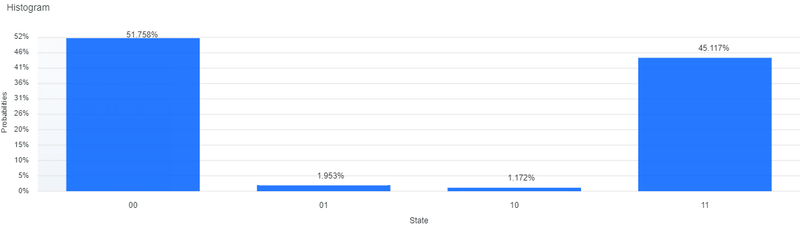

# Q Life
Notes and examples regarding Quantum Computing

## Entaglement

## Circuit



## Code
```
OPENQASM 2.0;
include "qelib1.inc";

qreg q[2];
creg c[2];

h q[0];
cx q[0],q[1];
measure q[0] -> c[0];
measure q[1] -> c[1];
```

## Results



# References
* https://quantum-computing.ibm.com/
