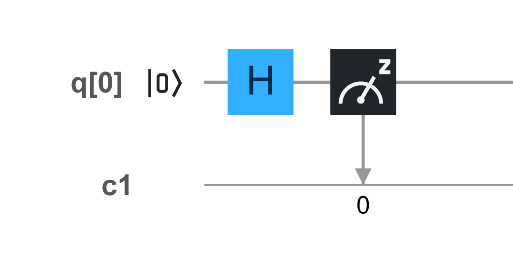
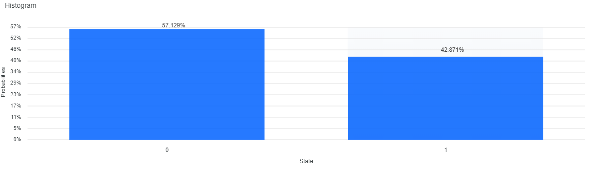

# Q Life
Notes and examples regarding Quantum Computing

* [RNG1](#RNG1)
* [RNG4](#RNG4)
* [Entaglement](#Entaglement)

## RNG1
Perfect single-bit random generator.

### Circuit



### Code
```
OPENQASM 2.0;
include "qelib1.inc";

qreg q[1];
creg c[1];

h q[0];
measure q[0] -> c[0];
```

### Results


## Entaglement

### Circuit


### Code
```
OPENQASM 2.0;
include "qelib1.inc";

qreg q[2];
creg c[2];

h q[0];
cx q[0],q[1];
measure q[0] -> c[0];
measure q[1] -> c[1];
```

### Results


## References
* https://quantum-computing.ibm.com/
